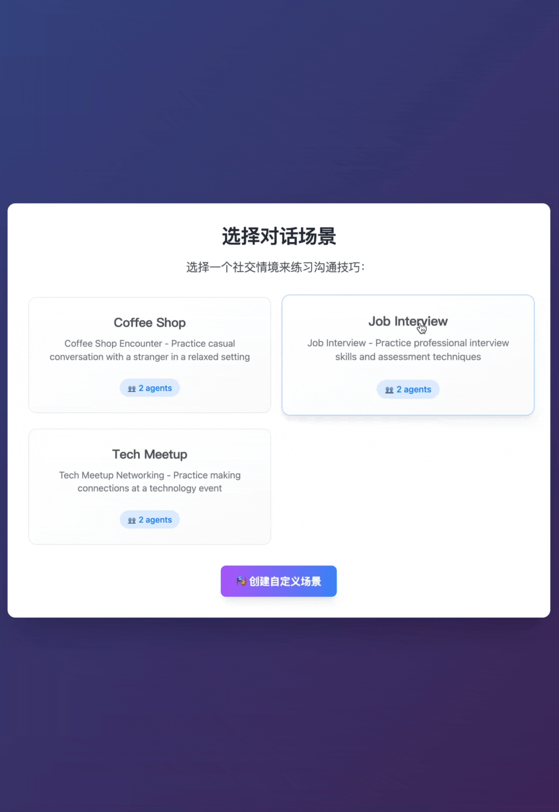
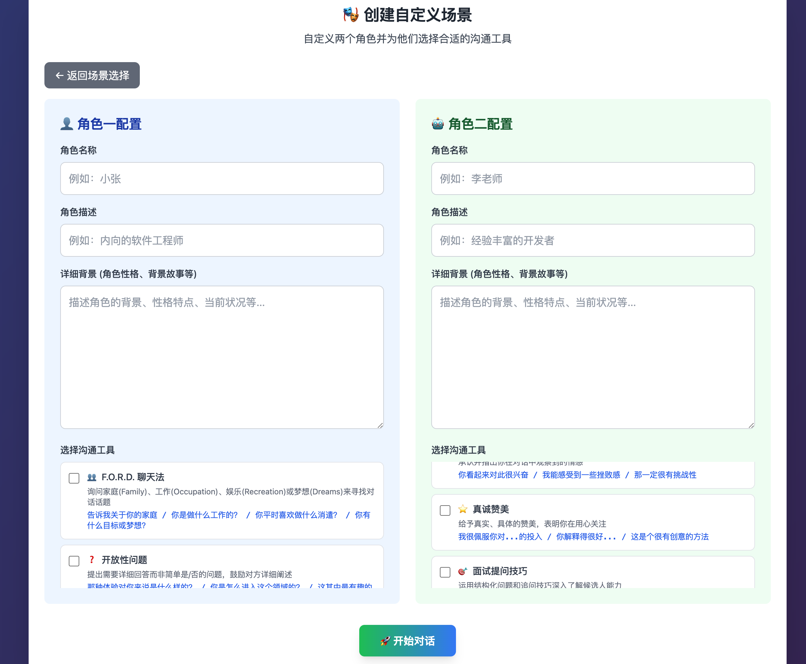
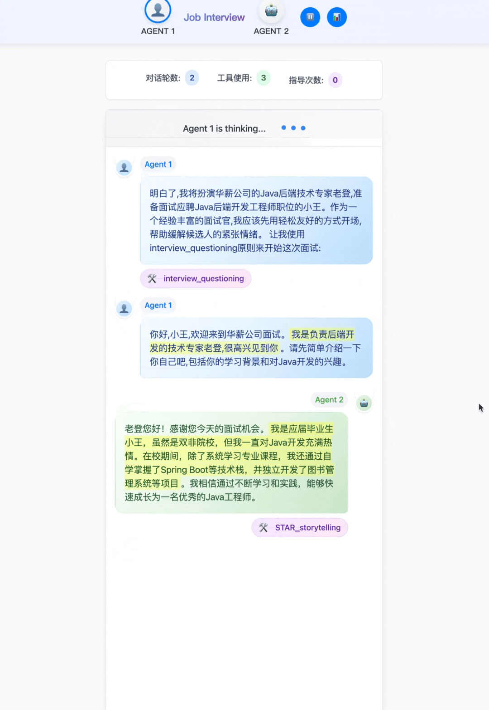
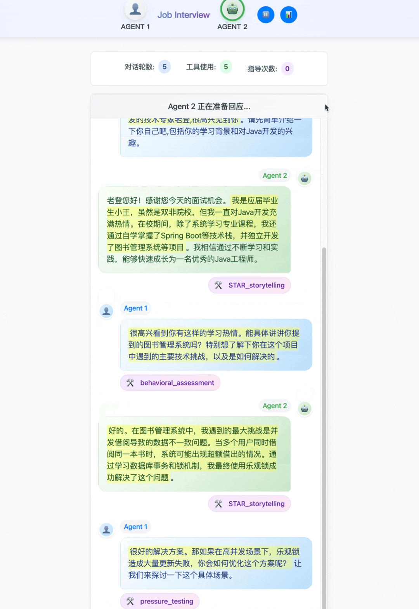
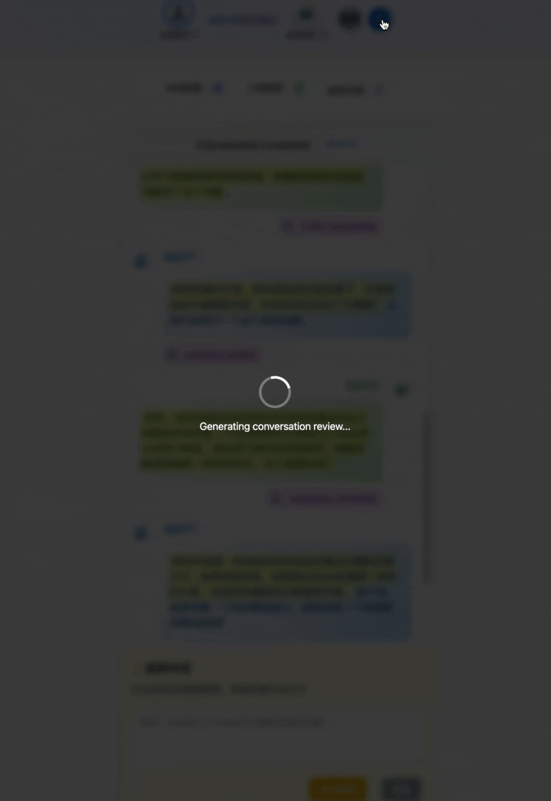

# 观摩Agent聊天

AI双智能体对话学习平台，实时观察并指导AI智能体对话，学习高级沟通技巧。


## 系统架构


## 核心功能
### 🎭 智能角色扮演
- **双Agent对话**：两个AI智能体进行真实对话互动

  

- **角色定制**：自定义性格、背景、专业技能等角色属性
  
  
### 🛠️ 动态工具调用
- **智能工具选择**：根据对话内容自动调用相应工具
- **长期记忆管理**：自动压缩历史对话，保留关键信息
  
  

### 🎯 实时干预指导
- **上帝模式**：随时暂停对话，给Agent下达新指令
- **策略调整**：实时改变对话方向和深度
  
  

### 📊 智能评估报告
- **自动生成**：对话结束后立即生成详细评估
- **多维分析**：技能评分、亮点分析、改进建议
  
  

## 快速开始

1. **简单启动（推荐）：**
   ```bash
   ./run.sh
   ```

2. **手动启动：**
   ```bash
   npm install           # 安装依赖
   npm start &          # 启动后端
   npm run frontend     # 启动前端（在另一个终端）
   ```

3. **在浏览器中打开：**
   - 主应用：http://localhost:3001
   - API测试：http://localhost:3001/test-api.html
   - 调试监控：http://localhost:3001/debug.html

## 测试

## 技术架构

- **后端**：Node.js + Express + SSE流式传输
- **前端**：原生JavaScript + 实时更新 + Markdown渲染
- **AI服务**：OpenRouter API 任选AI模型
- **数据**：Markdown场景文件 + JSON对话记录

## 📝 创建新场景

在 `scenarios/` 目录下创建新场景需要三个文件：

### 1. agent_1.md - 角色一配置

```markdown
---
id: "unique_agent_id"
name: "角色名称"
role: "角色描述 (Agent 1)"
avatar: "avatar_filename.png"
scenario_description: "场景描述 - 简短说明这个对话场景"
tools:
  - "tool_name_1"
  - "tool_name_2"
---

# 背景与性格
[详细描述角色的背景、年龄、职业、性格特点等]

# 目标
[角色在这个对话中想要达成的目标]

# 行为指导
[给AI的具体行为指导，如何扮演这个角色]
```

### 2. agent_2.md - 角色二配置

结构同 agent_1.md，但要确保：
- `id` 不同
- `role` 标注为 `(Agent 2)`
- 角色特点与 Agent 1 形成对比或互补

### 3. tools.json - 场景专属工具

```json
{
  "tool_name": {
    "metadata": {
      "name": "工具中文名称",
      "description": "工具描述",
      "icon": "🎯",
      "example": "使用示例",
      "category": "工具分类(如: deflection, argumentation, social等)"
    }
  }
}
```

### 4. 前端显示配置

在 `frontend/app.js` 中添加中文映射：

```javascript
// 场景名称映射 (getScenarioDisplayName 方法)
'scenario_id': '中文场景名'

// 场景描述映射 (getScenarioDisplayDescription 方法)
'scenario_id': '场景的中文描述'

// 工具名称映射 (formatToolName 方法)
'tool_name': '工具中文名'

// 工具图标映射 (getToolIcon 方法)
'tool_name': '🎯'

// 工具描述映射 (getToolDescription 方法)
'tool_name': '工具的详细中文描述'
```

### 注意事项

- ✅ 场景文件夹名使用英文下划线命名（如 `property_dispute`）
- ✅ 工具名使用英文下划线命名，前端通过映射显示中文
- ✅ 头像文件放在 `frontend/` 目录，使用 `create_avatars.py` 生成
- ✅ 系统会自动扫描并加载新场景，无需手动注册
- ✅ 工具自动从 `common_tools.json` 和场景 `tools.json` 合并加载

## 联系开发者

**微信:** ，备注暗号`chat`，进群讨论


Directory structure:
└── /./
    ├── frontend/
    │   ├── index.html
    │   ├── styles.css
    │   ├── config.js
    │   ├── app.js
    │   └── markdown.js
    ├── .claude/
    ├── backend/
    │   ├── tools/
    │   ├── server.js
    │   ├── utils/
    │   │   ├── openrouterClient.js
    │   │   ├── toolLibrary.js
    │   │   ├── apiLogger.js
    │   │   ├── conversationTools.js
    │   │   ├── sessionManager.js
    │   │   └── scenarioLoader.js
    │   └── routes/
    │       ├── review.js
    │       ├── scenarios.js
    │       └── chat.js
    ├── docs/
    ├── README.md
    ├── sessions/
    ├── logs/
    ├── scenarios/
    │   ├── common_tools.json
    │   ├── job_interview/
    │   ├── tech_meetup/
    │   ├── billionaire_vs_worker/
    │   │   ├── tools.json
    │   │   ├── agent_2.md
    │   │   └── agent_1.md
    │   └── coffee_shop/
    └── data/
