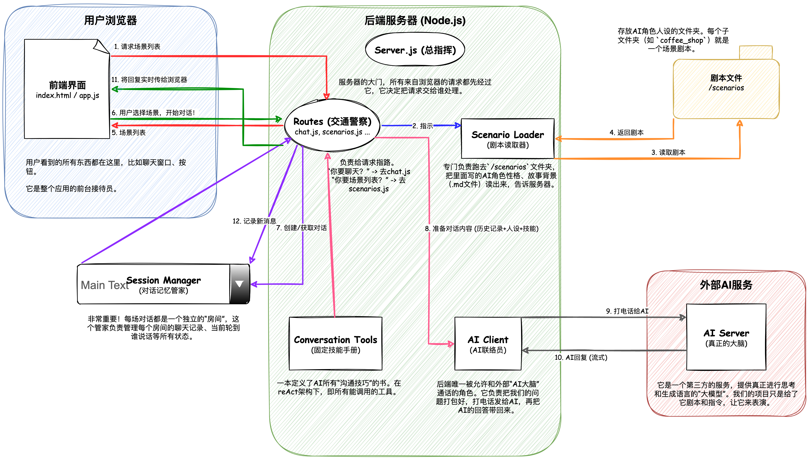

# Dual Agent Conversation Learning Platform

AI双智能体对话学习平台，实时观察并指导AI智能体对话，学习高级沟通技巧。

社交场景聊天Agent

## 系统架构



## 核心功能

- **场景选择**：多种社交场景（技术聚会、咖啡厅等）
- **实时流式对话**：SSE技术实现AI回复实时显示
- **沟通工具可视化**：可点击查看FORD方法等沟通原理详情
- **用户干预指导**：暂停对话并提供引导建议
- **对话分析评估**：生成详细的对话效果报告
- **Markdown渲染**：支持粗体、换行等格式化文本显示

## 使用案例

详细的使用演示和功能介绍请参考：[使用案例文档](docs/使用案例.md)
## 快速开始

1. **简单启动（推荐）：**
   ```bash
   ./run.sh
   ```

2. **手动启动：**
   ```bash
   npm install           # 安装依赖
   npm start &          # 启动后端
   npm run frontend     # 启动前端（在另一个终端）
   ```

3. **在浏览器中打开：**
   - 主应用：http://localhost:3001
   - API测试：http://localhost:3001/test-api.html
   - 调试监控：http://localhost:3001/debug.html

## 测试

## 技术架构

- **后端**：Node.js + Express + SSE流式传输
- **前端**：原生JavaScript + 实时更新 + Markdown渲染
- **AI服务**：OpenRouter API + Gemini 2.5 Flash模型
- **数据**：Markdown场景文件 + JSON对话记录

## 项目结构

```
完整Directory structure:
└── /./
    ├── frontend/
    │   ├── index.html
    │   ├── styles.css
    │   ├── config.js
    │   ├── app.js
    │   └── markdown.js
    ├── .claude/
    ├── backend/
    │   ├── server.js
    │   ├── utils/
    │   │   ├── openrouterClient.js
    │   │   ├── apiLogger.js
    │   │   ├── conversationTools.js
    │   │   ├── sessionManager.js
    │   │   └── scenarioLoader.js
    │   └── routes/
    │       ├── review.js
    │       ├── scenarios.js
    │       └── chat.js
    ├── docs/
    ├── run.sh
    ├── README.md
    ├── logs/
    ├── scenarios/
    │   ├── tech_meetup/
    │   └── coffee_shop/
    │       ├── agent_2.md
    │       └── agent_1.md
    └── data/